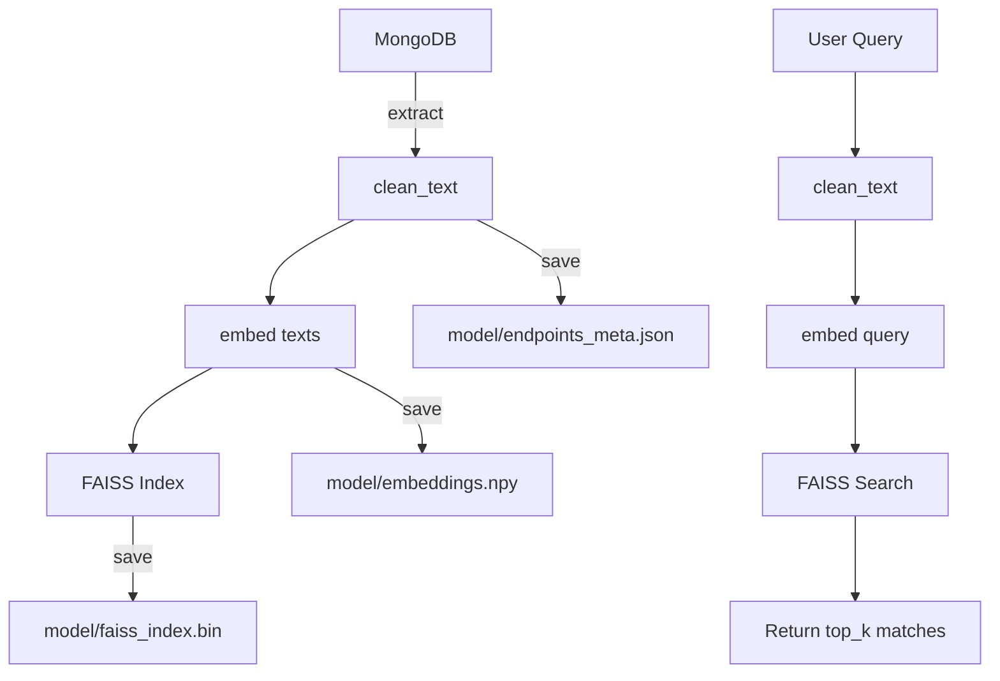

# Search Model - Full Technical Documentation

This document explains, in detail, the architecture, mathematical foundations, and workflow of the machine learning model used in the `endpoint_hub` project. It includes a deep dive into the files `train.py` and `search.py`, the embedding model, the use of FAISS for similarity search, and the underlying logic and data flow.

---

## Goal of the Model

The purpose of this system is to allow semantic search over a collection of API endpoints stored in a MongoDB database. Users can input natural language queries, and the system retrieves the most semantically relevant API endpoints.

---

## Data Source and Preparation

### MongoDB Connection

We connect to the MongoDB instance:

```python
MONGO_URI = "mongodb://user:password@<ip></ip>:<port>/?authMechanism=DEFAULT"
client = MongoClient(MONGO_URI)
db = client["ENDPOINT_HUB"]
col = db["ENDPOINTS"]
```

Each document in the `ENDPOINTS` collection contains at least:

- contains fields like `module`, `method`, `path`, `operationId`.
- `raw`: the raw Postman item JSON object.

### Preprocessing - `clean_text()`

Before embedding the text, the following operations are applied:

1. CamelCase splitting
2. Replacing hyphens/underscores with spaces
3. Removing non-alphanumeric characters
4. Lowercasing
5. Removing stopwords (English and Spanish)

This normalizes the text and reduces noise in the embedding process.

### Text Construction

Each API endpoint is transformed into a string:

```plaintext
<method> <url> <name>
```

Example:

```plaintext
GET /users/:id Get user details
```

This string is cleaned and then embedded.

---

## Embedding Model

We use the `all-MiniLM-L6-v2` model from the [Sentence Transformers](https://www.sbert.net/) library:

```python
model = SentenceTransformer("sentence-transformers/all-MiniLM-L6-v2")
```

### About the Model

- It's a distilled transformer model.
- Converts input text into a fixed-length dense vector (embedding).
- Captures semantic similarity, not just lexical overlap.

### Embedding Shape

Let:

- `N`: number of endpoints
- `D`: embedding dimension (typically 384 for MiniLM)

The embeddings matrix is of shape:

```python
[N, D] -> e.g., (300, 384)
```

---

## Training Phase - `train.py`

### Step-by-step

1. **Extract all endpoints from MongoDB**
2. **Generate embeddings for each cleaned text**
3. **Create FAISS index using L2 (Euclidean distance)**
4. **Save the embeddings (**``**), index (**``**) and metadata (**``**)**

### FAISS Index

```python
index = faiss.IndexFlatL2(d)  # d = embedding dimension
index.add(embeddings)         # Adds N vectors to the index
```

- Uses brute-force linear search (fast on small to medium scale).
- L2 distance is defined as: $\text{distance}(\vec{a}, \vec{b}) = \sum_{i=1}^{D} (a_i - b_i)^2$

### File Outputs

- `model/embeddings.npy`: Matrix of shape `[N, D]`
- `model/faiss_index.bin`: Saved FAISS index
- `model/endpoints_meta.json`: Original metadata + cleaned/original text

---

## Search Phase - `search.py`

### Step-by-step

1. **Clean the input query**
2. **Generate embedding for query**
3. **Load FAISS index and metadata**
4. **Perform k-NN search with FAISS**
5. **Return top-k matches with scores**

### Code

```python
query_embedding = model.encode([cleaned], convert_to_numpy = True)
distances, indices = index.search(query_embedding, q.top_k)
```

### Returned Data

Each match contains:

- `module`, `method`, `url`, `name`
- `cleaned_text`, `original_text`
- `score`: distance value (lower means more similar)

---

## Mathematical Foundation

### Embeddings

Each endpoint and query is represented as a dense vector: $(\vec{e}_1, \vec{e}_2, ..., \vec{e}_N \in \mathbb{R}^D)$

### Similarity Measure: L2 Distance

The most similar endpoints are those minimizing: $\| \vec{q} - \vec{e}_i \|^2$

Where:

- $\vec{q}$: the query vector
- $\vec{e}_i$: the ith endpoint vector

This selects the endpoints semantically closest to the input.

---

## Parameters

- `top_k`: number of closest endpoints to return (default: 5)
- `model`: SentenceTransformer("all-MiniLM-L6-v2")
- `index type`: FAISS IndexFlatL2 (brute-force L2 search)

---

## Data Flow



---

## Appendix

- **Libraries**:
  - `sentence-transformers`: text embedding
  - `faiss`: fast vector search
  - `numpy`: numerical ops
  - `pymongo`: database connection
- **Embedding model size**: \~80MB
- **Training time**: depends on N and CPU/GPU

---

## Example

Query: `"Crear usuario"`

Cleaned: `"crear usuario"`

Vector → FAISS search → Top 5 matches like:

- `POST /users` → "Crear nuevo usuario"
- `POST /registro` → "Registro de cuenta nueva"
